# Source Reconstruction of Induced EEG Responses using an LCMV Beamformer
This pipeline is used to analyse BrainVision EEG data taken in Nottingham (SPMIC) using MNE-python. Pre-processing, forward modelling, and source reconstruction are separated into three scripts. The below describes each script in detail to allow for easy usage and adaptation by non-experienced programmers/scientists.

**Important Notes:**
These scripts must be ran section-wise, as some stages require manual input from the user. For a more automated approach to some steps, see the equivalent scripts in *EEG_2back*.

Most MNE methods act in-place, e.g., running `data.do_operation()` will usually perform `do_operation` on `data`, without having to assign to a new variable. If you want to perform a method on an object without changing it, you would instead run `data.copy().do_operation()`, which applies `do_operation` to a copy of `data`, not `data` itself. 

## Pre-Processing
The goals of pre-processing EEG data (in this case) are as follows:
1) Remove high and low frequency noise
3) Find and interpolate bad channels
3) Perform ICA on the data to remove blink and cardiac artefacts

The steps here are designed to be fairly general, such that you can do a range of analysis using the pre-processing outputs.

#### Setting up Paths and Loading Data
The `root` path is the path that contains all of the data, both raw and processed, i.e., the *base* of the folder structure.

The `data_path` is the path within the `root` folder that contains the *raw* data, i.e., data **that has not been processed in any way**.

The `deriv_path` contains the *derivatives* of the raw data, i.e., data that **has been processed in some way**.

The raw data is loaded (.eeg, .vhdr and .vmrk files from BrainVision Recorder) using `read_raw_brainvision` and given the name `raw`, which is the standard name of all continuous (not segmented into trials/epochs) data objects in MNE. Note that we set `preload=True`, which loads the data into memory straight away - this is advisable as it prevents some easy mistakes later.

The script then prints out the `info` object to the console (`raw.info`). All data objects in MNE have an `info` attribute, which contains the meta-data related to the file. Understanding the `info` object is crucial as most methods in MNE use information contained in this to perform functions. Printing out the `info` object is a good sanity check and is useful in debugging.

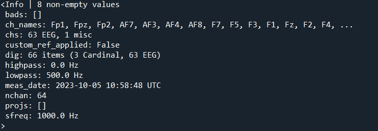

#### Setting a Standard Montage
Compared to MEG, where the position of the sensors is usually detailed in the raw data files, some care is required when dealing with *montages* in EEG. The *montage* object contains the information about the sensor names and locations. For pre-processing, we use `make_standard_montage` to set this as a standard montage for the EEG cap being used - in our case, an easycap-M1. When we do forward modelling in the next script, we will replace this with the real sensor positions, but for now it is useful to have a standard montage for various plots. The standard montage is shown below.

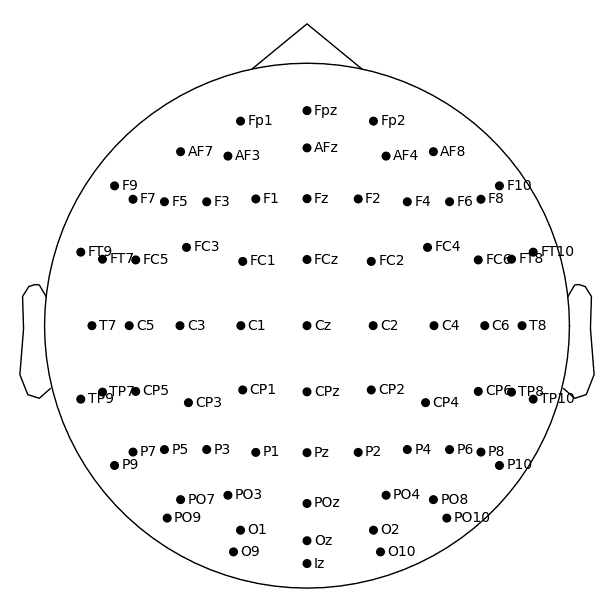

#### Downsampling

EEG data is sometimes taken at 1000Hz or even higher. This is far higher than any brain data we'll be looking at, so we downsample to 500Hz using `raw.resample()` (anything above around 200Hz should be fine to prevent aliasing).

#### Reading Downsampled Events

In the case of BrainVision files, triggers are usually recorded as *annotations* in the file. These are contained within the `raw.annotations` attribute, and can be read using `events_from_annotations`. It's important that we read the events **after** downsampling, as the timepoints will have changed. 

The output of `find_events` is an `events` array, which is a numpy array of shape (*n_events, 3*), where the first column is the datapoint, the second is the duration, and the third is the event value (or event *ID*).

#### Basic Pre-Processing
We now clean the data up by filtering to a *broadband* by applying the `filter` method to `raw`, setting `l_freq` (highpass) and `h_freq` (lowpass) thresholds. A broadband should include most of the brain activity of interest, excluding high and low frequencies to reduce noise. For EEG, 1 - 45 Hz contains most of the brain signals (evoked responses as well as delta/theta/alpha/beta rhythms), but removes a lot of low and high frequency noise.

Bad channels are selected by simply plotting the data using `raw.plot()` and left clicking on any channels that are particularly noisy. In the plot below, it is clear that F6 is particularly noisy compared to the other channels. For a more automated approach, see the equivalent script in *EEG_2back*. Bad channels are then interpolated using `raw.interpolate_bads()`. 

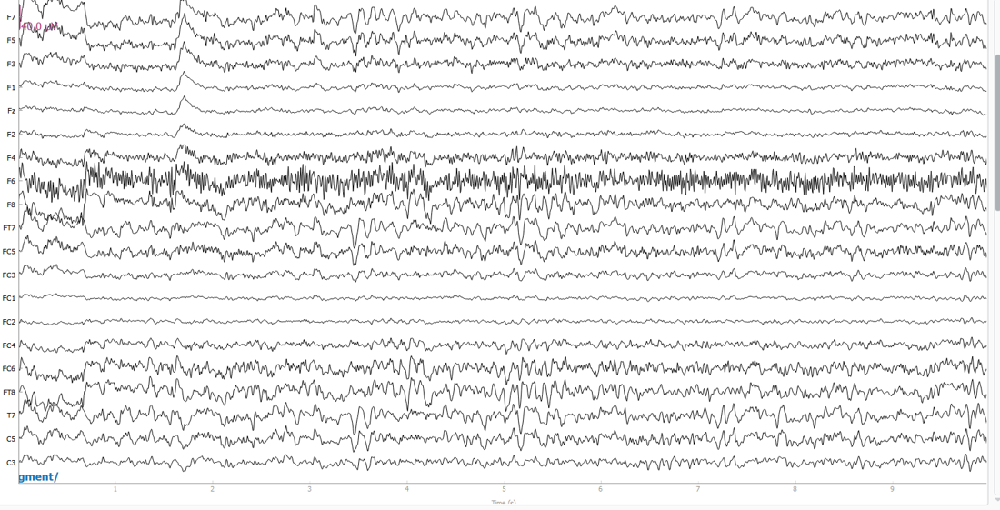

Now bad channels are removed, we can set the EEG *reference*. This is an important factor in EEG analysis, particularly sensor-level analysis, as the amplitudes of all channels will be set relative to this. For source-level analysis, **this should be set as the average of all channels**, as this spreads any forward model error across all sensors. It is also highly beneficial to set the reference as a *projection*, as this means any future changes to channels and bad segments etc will automatically update the reference, keeping the signal zero-mean. We apply this using `raw.set_eeg_reference()`, passing `"average"` and `projection=True`. 

Note that you might spot more bad channels after setting the average reference as the channel amplitudes will have been adjusted. With `projection=True`, the reference will be adjusted accordingly.

#### Annotating Muscle Artefacts for Cleaner ICA Fit
Before fitting ICA to remove blinking and cardiac artefacts, it is sensible to annotate any data segments that are corrupted by muslce artefacts. To do this we follow the standard MNE procedure, using `annotate_muscle_zscore`. This requires a `threshold` argument, which is in units of standard deviation. Note that this step is **only annotating for the sake of cleaner ICA fitting, we are not actually removing data at this stage**, we will remove bad segments later during epoching. Because of this, we can be fairly relaxed with the threshold. The only other argument worth changing is `filter_freq` - as muscle artefacts tend to manifest at higher frequencies, you should set this higher if using a wider broadband. An example of an annotated muscle artefact is shown below, but also note that some uncorrupted data has been annotated too.

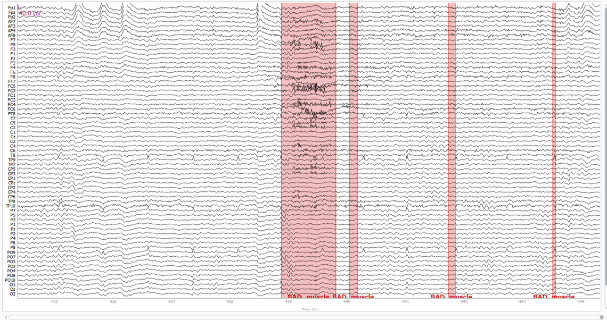

#### Power Spectral Density 
The power spectral density (PSD) is plotted at this stage (which automatically ignored the bad annotated segments) as a way to check that quality of the data after basic pre-processing. A good example is shown below.

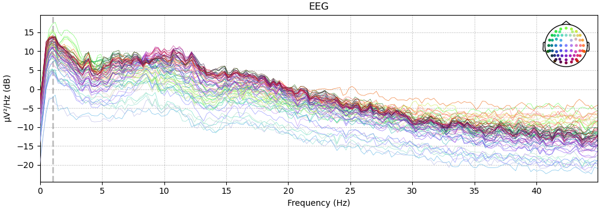

#### Artefact Removal using ICA
Now, ICA is used to remove cardiac and blinking artefacts, which can create spurious beamformer estimates if left in the data.

The `ICA` class is initialised, requiring only the number of components (`n_components`). In most cases, 20 or 30 is enough, as blinks and cardiac artefacts create a lot of variance in the data, meaning these are often contained in the top few components. 

Next, we `fit` the ICA object, passing the `raw` object. We set `reject_by_annotation=True` so that annotated muscle artefacts are ignored in the fit. We then plot topographical maps (topomaps) of the components, showing the spatial distribution of each, as well as the reconstructed timecourses. 

Bad ICA components are selected by left clicking on the reconstructured component timecourses. Blinking and cardiac components are quite easy to spot - see components 0 and 7 in the figure below.

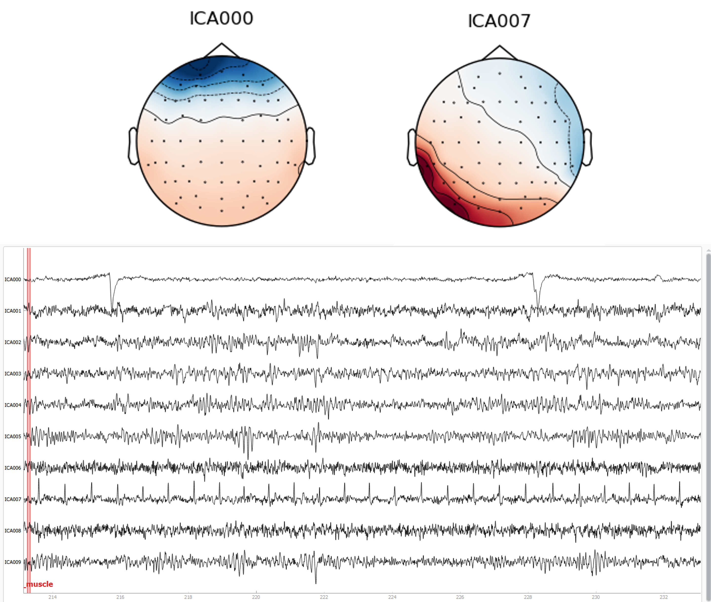

The next section then applies the ICA to the `raw` object, zeroing out the bad components. Note that if you run the whole script all at once, the ICA will be applied before you select the bad components, hence this script should be run section-wise. For a more automated ICA approach, see the equivalent script in *mTBI_predict_notts* or *EEG_2back*.

#### Removing Annotations
Before saving out the pre-processed data, we remove all annotations as we don't actually want to remove segments based on `annotate_muscle_zscore` as this method often annotates some good segments as well as bad, but it is sufficient for pre-ICA cleaning. Instead we will remove bad epochs later by eye.

#### Save out Pre-Processed Data
General pre-processing is now done. Save out the pre-processed file as a `.fif` in the derivatives folder. Note that the events are also saved out as we removed all annotations from the data.

## Forward Modelling
The components required for an EEG forward model are:
1) A segmented MRI, produced using FreeSurfer (see FreeSurfer section)
2) A transformation matrix (`trans`) that is used to map the segmented MRI to the space defined by the MEG sensors (often called co-registration)
3) A source-space (`src`), which is a set of coordinates within the segmented MRI that will be used to model magnetic dipoles
4) A conduction model (`bem`), which uses the segmented MRI to estimate field conduction through the head volume. 

A forward solution is then calculated using the above components. The outcome is a set of *lead fields* (`fwd`), which estimate how fields produced by dipoles at each of the source-space coordinates project onto the array of sensors.

The following sections will describe how each of these components are produced using the `2_forward_model.py` script.

Before beginning, note the line in the first section of the script:
`mne.viz.set_3d_options(depth_peeling=False, antialias=False)`
This seems to enable all the 3D plotting within MNE - without this line some of the features don't work properly on some computers.

#### Setting up Paths and Loading Data
Paths and data are loaded the same as in pre-processing. However, we load in the pre-processed data rather than the raw data.

#### Load FreeSurfer Files
Next we load the outputs from FreeSurfer. These are contained in the `subjects_dir` directory. For more information on this, see https://mne.tools/stable/auto_tutorials/forward/10_background_freesurfer.html.

If you have a FreeSurfer reconstruction for the subject, set `subjects_dir = r"path\to\your\freesurfer\subjects_dir"` and then set `fs_subject` to a string corresponding to the name of the subject folder in `subjects_dir`, e.g. "sub-01". If you do not have a FreeSurfer reconstruction for the subject MRI, set `subjects_dir = op.dirname(mne.datasets.fetch_fsaverage(verbose=True))`, and set `fs_subject = "fsaverage"`, which allows you to use a template freesurfer reconstruction from the MNI-152 brain. However, note that **fsaverage should only be used for testing, not proper study results**.

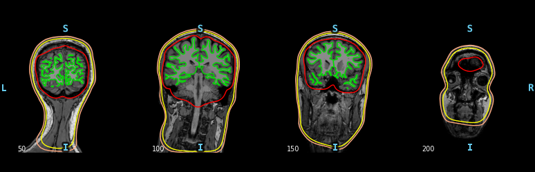

#### Setting a Proper Montage
So far we have set a standard montage in the `raw` object for the sake of visualisation. For source reconstruction we need to input the actual positions of the sensors, as well as headshape points. To do this we load in a .pos file, which is a simple text file with 4 columns containing the index/name of each point along with the xyz coordinates. Here, we made the .pos file from a 3D digitisation (EinScan), where the fiducial points (nasion, left/right preauricular) are at the bottom of the text file, with electrodes above (1 point per electrode) and headshape points above those. 

For this section, it is best to study the code to see how the text file is read and manipulated to create the digitisation. 

The real digitisation is shown below. This may look askew as we are working in a semi-arbitrary space, unlike the equivalent in MEG where we have a set coordinate system defined by the HPI coils and sensor array.

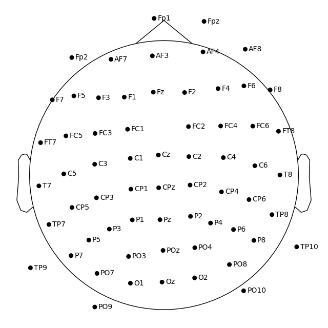

#### Co-Registration
Next we need to obtain a transformation matrix that maps the segmented MRI, loaded in the last section, to the position of the head in the MEG helmet. Here we take an automated approach, which works pretty well for most cases, but does not allow manual tweaking. 

The coregistration object, `coreg`, is created using `mne.coreg.Coregistration`, taking the `info` object (containing the digitisation), as well as the FreeSurfer folder and subject (containing the segmented MRI). Once this object is created, we can apply a series of methods to perform the coregistration.

Firstly, a crude transformation is performed by simply matching the *fiducial* positions in both the MRI and the digitisation. This is performed by running `coreg.fit_fiducials()`. The fiducial positions on the MRI are automatically estimated using the corresponding positions on fsaverage, and are therefore very approximate, but given that we will refine the transformation later, this is not too important. 

Next, an iterative closest point (ICP) algorithm is applied to match the surface of the MRI to the headshape points in the digitisation. To do this, we run `coreg.fit_icp()` with a single argument which is the number of iterations to perform - technically the more the better, but the algorithm will automatically stop at convergence (20 is usually enough).

An image of the MRI and EEG digitisation, before and after coregistration, is shown below.

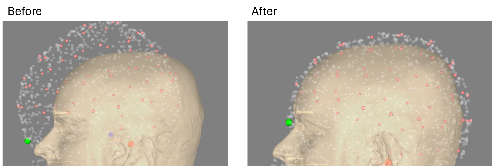

#### Computing a Source Space
Computing a source space is simple, but requires several choices that can impact your results. In general there are two options: surface source spaces and volume source spaces. Surface source spaces only define source space coordinates on the cortical surface, whereas volume source spaces define source space coordinates in a regular grid across the entire brain. Surface source spaces make it easier to work with *cortical parcellations* in FreeSurfer.

The main parameter we need to choose for a surface source space is `spacing`, which we set as `"oct6"`. This can be switched to `"oct5"` for a sparser (and therefore faster) source space.

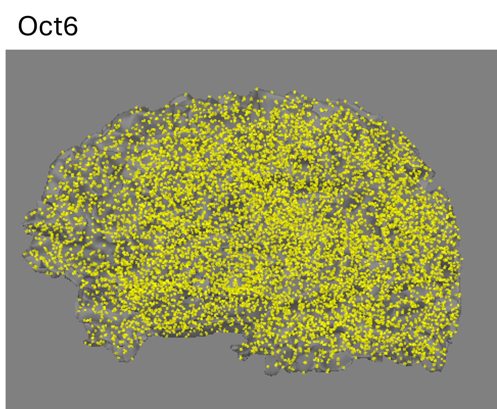

#### Computing the Conduction Model
Next, a conduction model is calculated using the boundary element method (BEM). This takes the segmented MRI from FreeSurfer, along with approximate conductivity values for each of the layers (brain, skull, scalp) to create a conduction model. The values of conductivity are standard and should not be changed.

#### Computing the Forward Solution
Now all components have been loaded or calculated, a forward model can be computed. Ensure that the modality is set correctly (`eeg=True`). The forward model object `fwd` contains the lead fields which are used later to calculate an inverse solution.

## Source Reconstruction
Here, we reconstruct the sources of activity in the brain using a linearly constrained minimum variance (LCMV) beamformer. This acts as a spatial filter, with unit gain at the location of interest and minimised filter output variance. Other source reconstruction methods exist (see *mTBI_predict_notts/min_norm_parcellation*), but LCMV is particularly good at locating precise sources of activity.

An LCMV beamformer derives a set *weights* for each location in the source-space, which can be multiplied by the sensor data to reconstruct source activity. The components required for constructing these weights are:
1) The lead fields, contained in the `fwd` object.
2) The data covariance.

Once beamformer weights have been calculated, these can be used to reconstruct the timeseries of activity at any location in the brain. Alternatively, we can apply the weights to the covariance during *active* and *control* windows to produce maps of activity related to a task. Both of these processes will be demonstrated below.

#### Setting up Paths and Loading Data
Again, setting up paths is identical to pre-processing.

Here, we load both the pre-processed data (`raw` object), as well as the forward model outputs (`fwd`) and events array.

#### Epoching
Using the `events` array, we can now *epoch* the data, i.e., chop it up around a particular trigger, or set of triggers. Doing this *after* pre-processing means we can very quickly test the responses to lots of different triggers without having to pre-process again. 

To initialise the `Epochs` class, the important inputs are the `event_id` and `tmin`/`tmax`. The `event_id` is the `value` of the trigger, which can be found in the third column of the `events` array. Both `tmin` and `tmax` are in seconds, and determine the time-window around the trigger for each trial.

Here, we set both `reject_by_annotation=False` and `reject=None`, as we manually inspect the epochs afterwards using `epochs.plot()` - this is good practice with EEG as it is generally more susceptible to artefacts than MEG and can vary a lot between scans/studies. Left clicking on bad epochs will remove them.

#### Computing the Covariance
The covariance of the data is a square matrix (n_channels, n_channels) that describes the *joint variability* of sensor data. The lead diagonal of the covariance matrix describes the overall variance, or power, of each sensor, while the off-diagonal points represent the temporal power interactions of each pair of sensors (sensor *connectivity*).

When calculating beamformer weights, it is often best to use broadband data (e.g. 1 - 45 Hz) so we don't constrain the possible outputs. However it is important that any bad segments have been removed first (achieved in our case by manually inspecting epochs). The covariance is simply calculated using `compute_covariance(epochs)`, and plotted using `cov.plot()`. An example is shown below. 

Note the eigenvalue decomposition plot on the right, which tells us the *rank* of the data (where the variance suddenly drops off). Essentially, this tells us how many indepdent vectors can be used to describe the data, which is often less than the number of channels due to sensor cross-talk. A rank-deficient covariance can cause issues when calculating the beamformer weights (due to matrix inversion). The *regularisation* parameter in the next section can be used to overcome this.

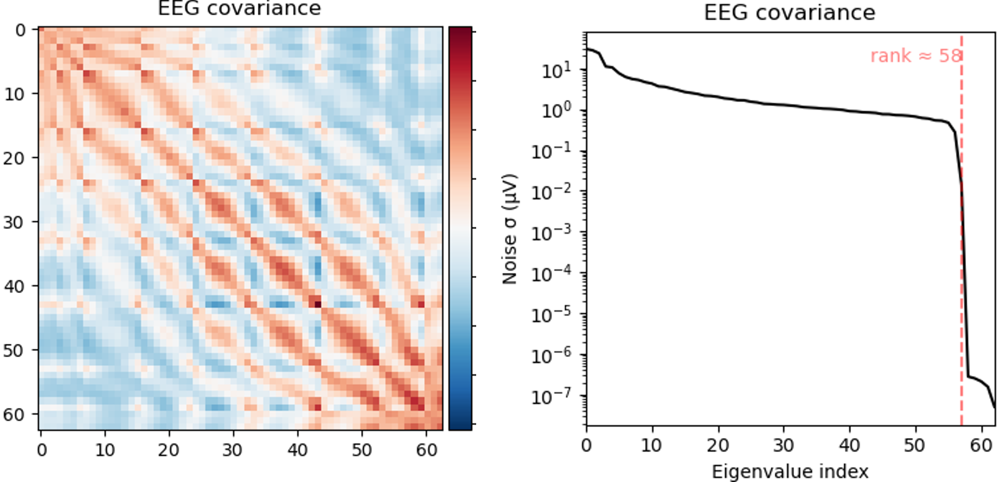

#### Calculating the Beamformer Weights
Now we have both the forward model (`fwd`) and the data covariance (`cov`), we can quite simply calculate a set of beamformer weights using `mne.beamformer.make_lcmv`. Most of the defaults are perfectly sufficient here, but be conscious of the `reg` parameter, which relates to the *regularisation* applied to the covariance matrix. Regularisation is essentially adding extra uniform variance to the data (lead diagonal of the covariance), preventing any particularly low eigenvalues from blowing up the inverse, but also reducing spatial resolution. As a rule of thumb, 5% regularisation (`reg=0.05`) works well in most cases and does not damage the data, although 0% regularisation should be used for maximum spatial resolution, if the covariance is not rank-deficient.

#### Activation Maps
Next we use the beamformer weights to calculate a so-called pseudo-T map, which compared the beamformer projected power during *active* and *control* windows.

Here, it is common to bandpass filter the data to localise activity in a particular frequency band, e.g. beta (13 - 30 Hz). We use `epochs.copy().filter` to do this - **note that we use `.copy()` and assign the output to a new variable name to prevent overwriting the unfiltered epochs object**.

We also need to select active and control windows. In this case, we are trying to localise the *increase in beta (13 - 30 Hz) power* that occurs post-stimulus (following finger abductions in this case). The control window should be placed far away from the activity of interest, either pre-stimulus or post-stimulus.

Using the **filtered** epochs object (`epochs_filt`) and the active and control windows, we calculate the active and control covariance matrices using `mne.compute_covariance`, passing the corresponding `tmin` and `tmax` for each.

We now apply the beamformer weights to the active and control covariance matrices, which **projects the filtered, time-windowed sensor power into source-space**. We do this using `apply_lcmv_cov`. Note that we index the `epochs` object here using the trigger of interest. The outputs are so-called source-time-course (`stc`) MNE objects - this can be confusing as we have projected *static power*, **not** timecourse activity, but all source-level objects in MNE are contained within `stc` objects.

The pseudo-T is then simply calculated by taking the difference of the active and control `stc` objects, and dividing by the sum of these. The result is a new `stc` object (called `pseudoT` in the script) which represents the change in band-limited power in the active window compared to the control window. This can be plotted using `pseudoT.plot`, passing the various anatomical arguments (`fwd['src']`, `subjects_dir`, `fs_subject`). You can customise this plot in various ways, e.g. by changing the `surface` that `pseudoT` is shown on, e.g. `'pial'` or `'inflated'`. I like the inflated brain as it shows activity peaks in both the *gyri* and *sulci*. An example is shown below, showing a clear rise in beta power in left motor regions, which is what we expect from this paradigm (right handed finger abductions).

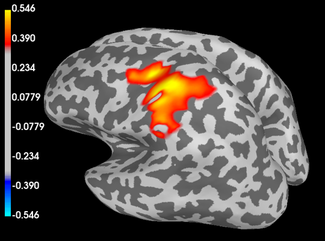

#### Morphing Pseudo-T to FSaverage
We can also morph the activation map to standard space, using `compute_source_morph` and loading in some standard space objects from `subjects_dir/fsaverage`. I have included an example of a more publication-ready plot here, showing the same pseudo-T from the previous section but morphed onto fsaverage and displayed in a more pleasing way.

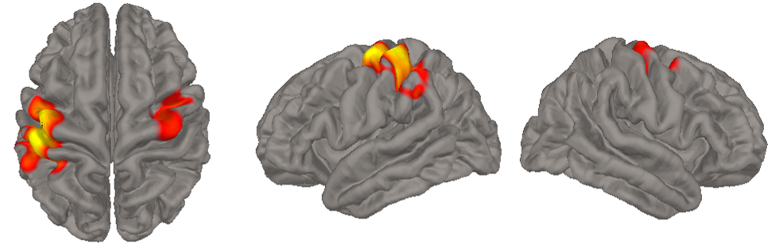

#### Extracting Peak Time-Frequency Response
This section is somewhat "hacky", as I create several artificial MNE objects so that I can use the functionality of the objects they are mimicking. If you are a beginner with MNE/Python/MEG, it is advisable that you do not attempt to splice any parts of this with your own code, i.e., use it only as it is written in the original script, changing only the superficial components (label indices/names, baseline values, frequency range etc).

To extract the time-frequency response in source-space, we first have to apply the beamformer weights to the **unfiltered** epochs object (`epochs`, **not** `epochs_filt`) using `apply_lcmv_epochs`. Again, we index `epochs` using the event ID of interest. Importantly, we set `return_generator=True`, meaning the output, `stc_epochs` is a Python *generator* which can be used to apply the beamformer to *one epoch at a time*, meaning we never have to store the entire source-level data in RAM. 

Next we extract *labels* from the FreeSurfer reconstruction using `read_labels_from_annot`. FreeSurfer basically outputs labels for each position on the reconstructed surface, which can then be used (if using a surface source space) to isolate the `src` positions that correspond to a particular parcel. A sensible choice for `parc` is "aparc", which is the anatomically-defined Desikan-Killany Atlas, containing 34 regions per hemisphere. We can then create a bigger ROI by creating a new label which is a combination of existing labels. To do this, read the `names` array, created by running `[i.name for i in labels]` and select a subset in a particular hemisphere. E.g. labels 32, 44 and 48 in "aparc" create a bigger left motor ROI that will be more forgiving of things like coregistration errors. Now change `label_name` to match the labels you've picked.

Using the new label, we create a *source epochs* object, which is just a fake `epochs` object. **Studying the code is the best way to see how this is done**. Simply put, we extract the peak of `pseudoT` within the label using `in_label` and `get_peak` methods. We then use the `stc_epochs` generator to get single epoch data at all source positions within the label, using `extract_label_time_course`. We then index this data using the peak source position to get each epoch of data at the peak source location. We then create an `info` object using channel names, types, and sampling frequency. This is then used to create an `epochs` object using `EpochsArray`.

Once we have `source_epochs`, it is trivial to get the time-frequency response as we can use the inbuilt methods contained in the `Epochs` class. First, we perform the time-frequency decomposition using `mne.time_frequency.tfr_morlet`, choosing an array of frequencies to look at. The output of this, `power`, can then be plotted using `power.plot`, choosing a relevant baseline (in seconds) based on the task. 

The peak frequency filtered timecourse can be obtained by applying the `filter`, `apply_hilbert`, `average` and `apply_baseline` methods to `source_epochs`. The numeric data from the resulting `evoked` object, called `peak_timecourse`, can be obtained by applying the `get_data` method.

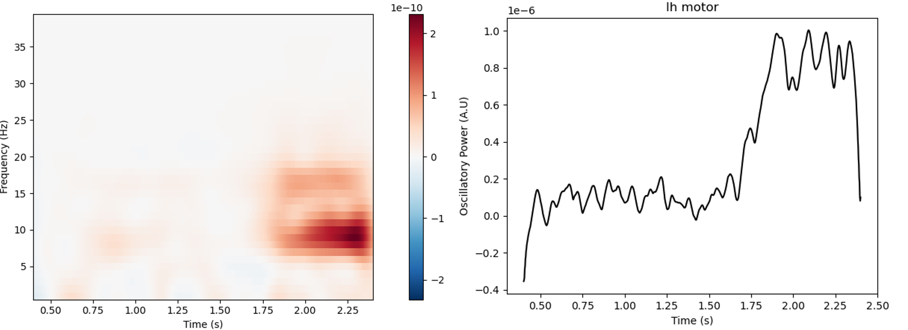

